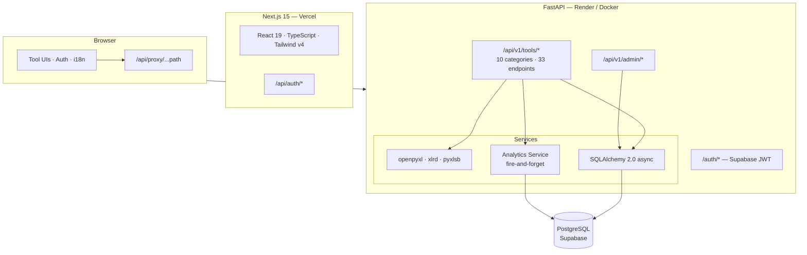
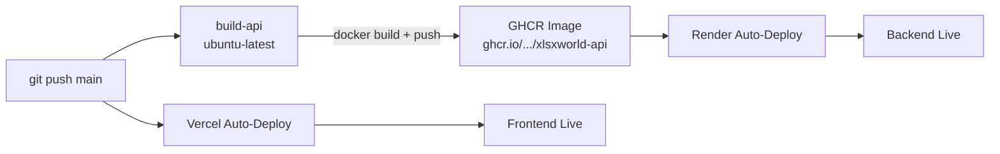

# XLSX World

Free online platform for working with Excel files — convert, merge, split, clean, inspect, analyze, format, and more. No signup or installation required.

> **📖 Documentation:** [Root](README.md) · [Client](client/README.md) · [Server](server/README.md)

## Architecture

XLSX World is a monorepo with two independently deployable services that communicate through a proxy layer:



## Tool Catalog

| Category | Tools | Count |
|---|---|---|
| **Convert** | CSV ↔ XLSX, JSON ↔ XLSX, SQL ↔ XLSX, XML ↔ XLSX, PDF ↔ XLSX | 10 |
| **Merge** | Append workbooks, merge sheets | 2 |
| **Split** | Split by sheet, split by rows/columns | 2 |
| **Clean** | Find & replace, normalize case, remove duplicates, trim spaces, remove empty rows | 5 |
| **Inspect** | Preview and paginate sheet data in-browser | 1 |
| **Analyze** | Summary stats, compare workbooks, scan formula errors | 3 |
| **Format** | Auto-size columns, freeze header | 2 |
| **Data** | Sort rows, split column, transpose sheet | 3 |
| **Validate** | Detect blanks, validate emails | 2 |
| **Security** | Password protect, remove password | 2 |

**Total: 32 tools** across 10 categories. The tool registry lives in [`client/components/tools/toolsData.ts`](client/components/tools/toolsData.ts).

## Tech Stack

| Layer | Technology | Version |
|---|---|---|
| Frontend | Next.js (App Router, Turbopack) | 15.5.14 |
| UI | React, TypeScript | 19.1.0, 5.x |
| Styling | Tailwind CSS + CSS custom properties | v4 |
| i18n | next-intl (en, es, fr, pt) | 4.9.0 |
| Backend | FastAPI, Python | 0.116.1, 3.13 |
| ORM | SQLAlchemy (async) + asyncpg | 2.0.36 |
| Excel | openpyxl, xlrd, pyxlsb | 3.1.5 |
| Database | PostgreSQL via Supabase | — |
| Auth | Supabase Auth (JWT, ES256 JWKS) | — |
| Frontend hosting | Vercel (standalone output) | — |
| Backend hosting | Render (Docker) | — |
| CI/CD | GitHub Actions (Docker build + deploy) | — |

## Project Layout

```
xlsxworld/
├── client/                  # Next.js frontend — see client/README.md
├── server/                  # FastAPI backend  — see server/README.md
├── .amazonq/rules/          # Amazon Q rules and memory bank
├── .github/workflows/
│   └── docker.yml           # Build GHCR image on push
├── .husky/
│   └── pre-push             # Runs verify:ci before push
├── docker-compose.yml       # Backend container (app-network, health check)
├── render.yaml              # Render deployment config (Docker, free plan)
└── package.json             # Root orchestration: concurrently, husky, lint-staged, prettier
```

## Quick Start

### Prerequisites

| Requirement | Notes |
|---|---|
| Node.js ≥ 18 | For the Next.js frontend |
| Python 3.13 | Pinned in `server/.python-version` |
| [uv](https://docs.astral.sh/uv/) | Python package manager (replaces pip) |
| PostgreSQL | Via Supabase or local instance |

### 1. Install dependencies

```bash
npm install          # Installs root + client deps
cd server && uv sync # Installs Python deps
```

### 2. Configure environment

```bash
# Client
cp client/.env.local.example client/.env.local   # If available, or create manually
# Minimum: NEXT_PUBLIC_API_BASE=http://localhost:8000

# Server
cp server/.env.example server/.env
# Fill in DATABASE_URL, SUPABASE_URL, SUPABASE_PUBLISHABLE_KEY, SUPABASE_SECRET_KEY
```

### 3. Run database migrations

```bash
cd server
uv run alembic upgrade head
```

### 4. Start both services

```bash
npm run dev
# → client on http://localhost:3000
# → server on http://localhost:8000
```

Or run individually:

```bash
npm run dev:client   # Next.js with Turbopack on :3000
npm run dev:server   # FastAPI with --reload on :8000
```

## All Root Commands

| Command | Description |
|---|---|
| `npm run dev` | Start client + server concurrently |
| `npm run dev:client` | Start Next.js only |
| `npm run dev:server` | Start FastAPI only |
| `npm run build` | Production build (client) |
| `npm run verify:ci` | Type-check → lint → build (used by pre-push hook) |
| `npm run format` | Prettier format all client files |

## CI/CD

The GitHub Actions workflow (`.github/workflows/docker.yml`) runs on pushes to `main` and `test`:



1. **build-api** — Builds the server Docker image and pushes to GHCR (`ghcr.io/<owner>/xlsxworld-api`)
2. **Render** — Auto-deploys from `main` using the Docker image

The frontend deploys automatically to Vercel on push to `main`.

## Deployment

| Service | Platform | Config file | Notes |
|---|---|---|---|
| Frontend | Vercel | `client/next.config.ts` | Standalone output, auto-deploy |
| Backend | Render | `render.yaml` | Docker, free plan, auto-deploy from `main` |
| Backend (alt) | Docker Compose | `docker-compose.yml` | `docker compose up` locally |

## Code Quality

- **TypeScript**: Strict mode, no implicit any
- **ESLint**: Flat config extending `next/core-web-vitals` + `next/typescript`
- **Prettier**: Root-level, runs via lint-staged on pre-commit
- **Husky**: Pre-push hook runs `verify:ci` (type-check + lint + build)
- **Python**: Type hints everywhere, `from __future__ import annotations` in every file

## Testing

```bash
# Frontend (Jest + React Testing Library)
cd client && npm test

# Backend (pytest + pytest-asyncio)
cd server && uv run pytest
```

Test files are co-located with source: `Component.test.tsx`, `api.test.ts`, `tests/`.

## Documentation Map

| Document | Covers |
|---|---|
| **[Root README](README.md)** (this file) | Architecture, tool catalog, tech stack, quick start, CI/CD, deployment |
| **[Client README](client/README.md)** | Frontend routing, theming, i18n, API client, component patterns, testing |
| **[Server README](server/README.md)** | Backend architecture, tool registration, all API endpoints, adding new tools, Docker, migrations |
