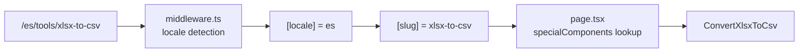
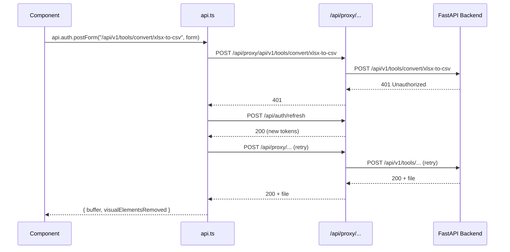
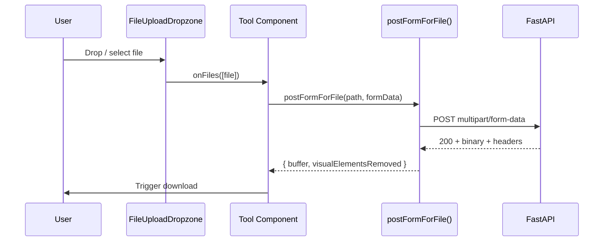

# XLSX World — Client

Next.js 15 frontend for the XLSX World tool suite. Serves all user-facing pages, proxies API requests to the FastAPI backend, and handles authentication via Supabase.

> **📖 Documentation:** [Root](../README.md) · [Client](README.md) · [Server](../server/README.md)

## Tech

| Technology | Version | Purpose |
|---|---|---|
| Next.js | 15.5.14 | App Router, Turbopack, standalone output |
| React | 19.1.0 | UI library |
| TypeScript | 5.x | Strict mode, `@/*` path aliases |
| Tailwind CSS | v4 | Layout/spacing (via `@tailwindcss/postcss`) |
| next-intl | 4.9.0 | i18n — 4 locales: `en`, `es`, `fr`, `pt` |
| lucide-react | 1.7.0 | Primary icon library |
| recharts | 3.8.1 | Charts (admin dashboard) |
| @marsidev/react-turnstile | 1.5.0 | Cloudflare Turnstile CAPTCHA |

## Directory Structure

```
client/
├── app/
│   ├── [locale]/                      # i18n dynamic segment (en, es, fr, pt)
│   │   ├── tools/[slug]/             # Dynamic tool pages — one component per tool
│   │   │   ├── analyze/              # SummaryStats, CompareWorkbooks, ScanFormulaErrors
│   │   │   ├── clean/                # FindReplace, NormalizeCase, RemoveDuplicates, TrimSpaces, RemoveEmptyRows
│   │   │   ├── convert/              # 10 converter components (CSV/JSON/SQL/XML/PDF ↔ XLSX)
│   │   │   ├── data/                 # SortRows, SplitColumn, TransposeSheet
│   │   │   ├── format/               # AutoSizeColumns, FreezeHeader
│   │   │   ├── inspect/              # InspectSheets (in-browser preview + pagination)
│   │   │   ├── merge/                # AppendWorkbooks, MergeSheets
│   │   │   ├── security/             # PasswordProtect, RemovePassword
│   │   │   ├── split/                # SplitSheet, SplitWorkbook
│   │   │   ├── validate/             # DetectBlanks, ValidateEmails
│   │   │   └── page.tsx              # Slug router — maps slug → component via specialComponents record
│   │   ├── admin/                     # Admin dashboard (tabs-based, requires admin role)
│   │   ├── contact/, faq/, privacy/, terms/  # Static pages
│   │   ├── login/, signup/, forgot-password/, reset-password/, my-account/
│   │   ├── layout.tsx                 # Locale layout (Header, Footer, providers)
│   │   ├── page.tsx                   # Homepage (tool grid)
│   │   ├── error.tsx, loading.tsx, not-found.tsx
│   ├── api/
│   │   ├── auth/[action]/             # Auth routes: login, signup, refresh, logout
│   │   │   └── _session.ts            # Cookie-based session helpers
│   │   └── proxy/[...path]/           # Catch-all proxy → FastAPI backend
│   ├── globals.css                    # CSS custom properties, theme, tool-card styles
│   ├── layout.tsx                     # Root layout (fonts, analytics, ThemeProvider)
│   ├── robots.ts, sitemap.ts          # SEO
├── components/
│   ├── auth/                          # AuthProvider (context), useRequireAuth (hook)
│   ├── common/                        # FileUploadDropzone, BackToTopButton, DotTrail
│   ├── layout/                        # Header, Footer, LanguageToggle
│   ├── theme/                         # ThemeProvider, ThemeToggle (light/dark)
│   └── tools/                         # Tools grid, ToolsFilter, SuggestTool, toolsData.ts, useToolTranslations
├── i18n/
│   ├── routing.ts                     # Locale config: ["en", "es", "fr", "pt"], default "en"
│   ├── request.ts                     # Server-side locale resolution
│   └── navigation.ts                  # Typed Link, useRouter, usePathname
├── lib/
│   ├── auth/                          # Supabase client, constants, types
│   ├── tools/                         # API functions per category (analyze.ts, clean.ts, convert.ts, etc.)
│   ├── api.ts                         # Central HTTP client — proxy routing, auth refresh, error handling
│   ├── admin.ts                       # Admin API functions
│   └── seo.ts                         # Tool SEO metadata, JSON-LD generation
├── messages/                          # i18n JSON files (en.json, es.json, fr.json, pt.json)
├── types/                             # Global TypeScript declarations
└── middleware.ts                      # next-intl locale detection middleware
```

## Setup

```bash
cd client
npm install
```

## Environment

Create `.env.local`:

```env
NEXT_PUBLIC_API_BASE=http://localhost:8000
NEXT_PUBLIC_SITE_URL=http://localhost:3000
NEXT_PUBLIC_SUPABASE_URL=<your-supabase-url>
NEXT_PUBLIC_SUPABASE_ANON_KEY=<your-supabase-anon-key>
```

## Commands

| Command | Description |
|---|---|
| `npm run dev` | Dev server with Turbopack on http://localhost:3000 |
| `npm run build` | Production build with Turbopack |
| `npm run start` | Start production server |
| `npm run lint` | ESLint (flat config: next/core-web-vitals + next/typescript) |
| `npm run type-check` | `tsc --noEmit` |
| `npm run test` | Jest + React Testing Library |

## Key Patterns

### Routing



All tool pages use a single dynamic route: `app/[locale]/tools/[slug]/page.tsx`. The page maps the URL slug to a React component via a `specialComponents` record:

```tsx
const specialComponents: Record<string, React.ReactNode> = {
  "xlsx-to-csv": <ConvertXlsxToCsv />,
  "inspect-sheets": <InspectSheets />,
  // ... 32 tools total
};
```

Static params are generated from `ACTIVE_TOOL_SLUGS` × `routing.locales` for full SSG.

### Tool Registry

[`components/tools/toolsData.ts`](components/tools/toolsData.ts) is the single source of truth for all tools:

```ts
export interface ToolItem {
  href: string;
  slug: string;
  icon: string;
  category: string;
  commingSoon?: boolean;
  isNew?: boolean;
}
export const toolItems: ToolItem[] = [ /* 33 entries */ ];
```

The homepage grid, tool filtering, SEO sitemap, and static param generation all derive from this array.

### API Client

[`lib/api.ts`](lib/api.ts) provides a centralized HTTP client with automatic proxy routing and auth refresh:



- All `/api/*` paths are normalized through the Next.js proxy (`/api/proxy/[...path]` → FastAPI)
- Public methods: `api.get()`, `api.postForm()`, `api.postJson()`, `api.patchJson()`
- Auth-protected methods: `api.auth.get()`, `api.auth.postJson()`, etc. — auto-retry on 401 with token refresh, redirect to login on failure
- File downloads: `postFormForFile()` returns `{ buffer: ArrayBuffer, visualElementsRemoved: boolean }`
- Tool-specific wrappers in `lib/tools/<category>.ts` (e.g., `lib/tools/convert.ts`, `lib/tools/inspect.ts`)

### Theming

Colors are defined as CSS custom properties in [`globals.css`](app/globals.css), not Tailwind color classes:

- Light/dark mode via `.dark` class toggle (managed by `ThemeProvider`)
- Core tokens: `--background`, `--foreground`, `--surface`, `--surface-2`, `--border`, `--muted`, `--muted-2`, `--primary`, `--primary-soft`
- Tag/pill system: `--tag-bg`, `--tag-text`, `--tag-border`, `--tag-selected-bg`, `--tag-selected-text`
- Applied via inline `style={{ color: "var(--muted-2)" }}` on elements
- Custom font: "Alan Sans" (weights 300–900)

### i18n

- 4 locales: `en`, `es`, `fr`, `pt` — configured in [`i18n/routing.ts`](i18n/routing.ts)
- Middleware detects locale from URL path (`/en/tools/...`, `/es/tools/...`)
- Components use `useTranslations("common")` for shared strings, `useTranslations("tools")` for tool-specific
- Translation keys are camelCase: `t("quickSearch")`, `t("showingRows", { loaded, total })`
- JSON message files in `messages/` directory

### Component Conventions

- All interactive components start with `"use client"` directive
- Default exports for components, named exports for data
- `interface` over `type` for object shapes
- Explicit state typing: `useState<WorkbookPreview | null>(null)`
- Module-level constants in UPPER_SNAKE_CASE
- Tooltip pattern: `group relative` wrapper + absolutely positioned span with `opacity-0 group-hover:opacity-100`
- Icon buttons: `lucide-react` icons with `aria-hidden="true"`, wrapped in `<button>` with `aria-label`

### File Upload



The `FileUploadDropzone` component handles drag-and-drop and click-to-upload with configurable `accept` MIME types. Tool components call `postFormForFile()` which returns the processed file as an `ArrayBuffer` plus a `visualElementsRemoved` flag (set when charts/drawings/media were stripped from the XLSX).

## Testing

Tests are co-located with source files:

```
components/auth/AuthProvider.test.tsx
components/auth/useRequireAuth.test.tsx
app/[locale]/login/page.test.tsx
app/[locale]/signup/page.test.tsx
app/api/proxy/proxy-route.test.ts
lib/api.test.ts
```

Config: [`jest.config.cjs`](jest.config.cjs) — jsdom environment, `@/*` path alias mapping, ts-jest transform.
