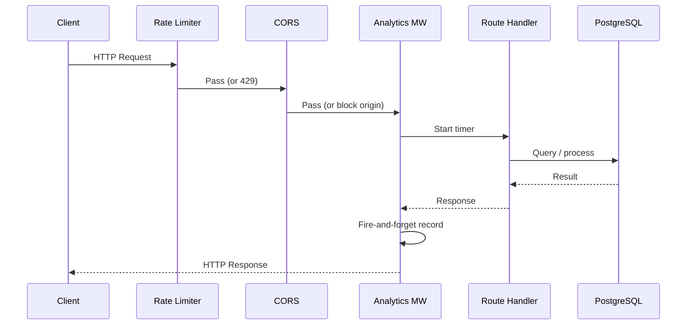
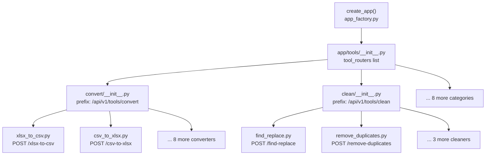
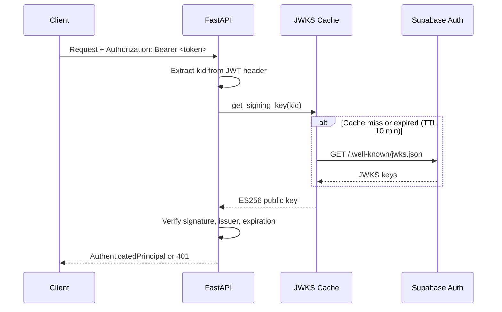
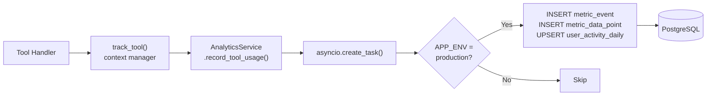

# XLSX World — Backend

FastAPI backend for XLSX World. Provides Excel processing endpoints, authentication, analytics, and an admin dashboard API.

> **📖 Documentation:** [Root](../README.md) · [Client](../client/README.md) · [Server](README.md)

## Tech

| Technology | Version | Purpose |
|---|---|---|
| FastAPI | 0.116.1 | Web framework |
| Python | 3.13 | Runtime (pinned in `.python-version`) |
| Uvicorn | 0.39.0 | ASGI server |
| SQLAlchemy | 2.0.36 | Async ORM (asyncpg driver) |
| Pydantic | 2.12.5 | Validation, settings (`BaseSettings`) |
| openpyxl | 3.1.5 | Excel (.xlsx) manipulation |
| xlrd | 2.0.1 | Legacy Excel (.xls) reading |
| pyxlsb | 1.0.10 | Binary Excel (.xlsb) reading |
| Alembic | 1.14.1 | Database migrations |
| SlowAPI | 0.1.9+ | Rate limiting |
| Sentry SDK | 2.37.1 | Error tracking |
| python-jose | 3.3.0 | JWT verification (ES256 via Supabase JWKS) |

## Directory Structure

```
server/
├── main.py                              # Entrypoint — create_app()
├── Dockerfile                           # Multi-stage build (python:3.13-slim)
├── pyproject.toml                       # Dependencies and project metadata
├── requirements.txt                     # Pinned deps for Docker builds
├── alembic.ini                          # Alembic config
├── pytest.ini                           # pytest config (asyncio_mode = auto)
├── .env.example                         # Environment variable template
├── alembic/                             # Database migration revisions
├── tests/                               # pytest test suite
└── app/
    ├── core/
    │   ├── app_factory.py               # create_app() — CORS, middleware, routers, exception handlers
    │   ├── config.py                    # Pydantic Settings (env-based, lru_cache singleton)
    │   ├── security.py                  # Supabase JWT verification (JWKS cache, ES256)
    │   ├── rate_limit.py                # SlowAPI rate limiter setup
    │   └── openapi_custom.py            # Custom OpenAPI schema
    ├── db/
    │   ├── models/                      # SQLAlchemy models
    │   │   ├── users.py                 # AppUser (roles: user/admin, status: active/suspended)
    │   │   ├── analytics.py             # MetricEvent, MetricDataPoint, UserActivityDaily
    │   │   ├── billing.py               # Billing models
    │   │   └── _mixins.py               # Shared model mixins
    │   ├── base.py                      # Declarative base
    │   └── session.py                   # Async session factory (get_db_session dependency)
    ├── middleware/
    │   └── analytics.py                 # Request-level analytics tracking
    ├── routes/
    │   ├── system.py                    # GET / (status), GET /health
    │   ├── auth.py                      # POST /auth/signup, /login, /refresh, /logout, GET /auth/me
    │   ├── contact.py                   # POST /api/v1/contact (webhook + Telegram)
    │   └── admin.py                     # GET /api/v1/admin/* (overview, tools, users, activity, performance)
    ├── schemas/                         # Pydantic request/response schemas
    ├── services/
    │   ├── analytics_service.py         # Fire-and-forget analytics (asyncio.create_task)
    │   ├── auth_service.py              # Supabase auth operations
    │   ├── contact_delivery.py          # Webhook + Telegram contact form delivery
    │   └── excel_reader.py              # parse_excel_bytes(), ensure_supported_excel_filename()
    └── tools/                           # Excel tool implementations (10 categories)
        ├── __init__.py                  # Collects all tool routers into tool_routers list
        ├── _common.py                   # Shared utilities (read_with_limit, file_response, etc.)
        ├── analyze/                     # summary_stats, compare_workbooks, scan_formula_errors
        ├── clean/                       # find_replace, normalize_case, remove_duplicates, remove_empty_rows, trim_spaces
        ├── convert/                     # csv↔xlsx, json↔xlsx, sql↔xlsx, xml↔xlsx, pdf↔xlsx (10 converters)
        ├── data/                        # sort_rows, split_column, transpose_sheet
        ├── format/                      # auto_size_columns, freeze_header
        ├── inspect/                     # preview, page_sheet (_store for server-side caching)
        ├── merge/                       # append_workbooks, merge_sheets
        ├── security/                    # password_protect, remove_password
        ├── split/                       # split_sheet, split_workbook
        └── validate/                    # detect_blanks, validate_emails
```

## Setup

### Prerequisites

- Python 3.13 (pinned in `.python-version`)
- [uv](https://docs.astral.sh/uv/) package manager
- PostgreSQL (via Supabase or local)

> **Note:** Python 3.14 may fail on Windows with `httptools` build errors unless Microsoft C++ Build Tools are installed.

### Install dependencies

```bash
cd server
uv sync
```

### Configure environment

```bash
cp .env.example .env
```

**Required variables:**

| Variable | Description |
|---|---|
| `DATABASE_URL` | Direct Postgres connection (port 5432) — used by main sessions and Alembic |
| `DATABASE_POOL_URL` | Pooled Postgres connection (port 6543) — used by analytics service |

**Optional variables:**

| Variable | Default | Description |
|---|---|---|
| `APP_ENV` | `development` | Set to `production` to enable analytics writes |
| `DB_POOL_SIZE` | `10` | SQLAlchemy pool size |
| `DB_MAX_OVERFLOW` | `20` | SQLAlchemy max overflow |
| `DB_POOL_TIMEOUT` | `30` | Pool connection timeout (seconds) |
| `DB_POOL_RECYCLE` | `1800` | Connection recycle interval (seconds) |
| `DB_ECHO_SQL` | `false` | Log SQL statements |
| `SUPABASE_URL` | — | Supabase project URL (for auth) |
| `SUPABASE_PUBLISHABLE_KEY` | — | Supabase anon key |
| `SUPABASE_SECRET_KEY` | — | Supabase service role key |
| `CORS_ORIGINS` | — | Comma-separated allowed origins |
| `CONTACT_WEBHOOK_URL` | — | Webhook URL for contact form |
| `CONTACT_WEBHOOK_TIMEOUT` | `10` | Webhook timeout (seconds) |
| `CONTACT_TELEGRAM_ENABLED` | `false` | Enable Telegram contact delivery |
| `CONTACT_TELEGRAM_BOT_TOKEN` | — | Telegram bot token |
| `CONTACT_TELEGRAM_CHAT_ID` | — | Telegram chat ID |

### Run database migrations

```bash
uv run alembic upgrade head
```

### Start the server

```bash
uv run uvicorn main:app --host 0.0.0.0 --port 8000 --reload
```

Verify: http://localhost:8000/health → `{"status": "ok"}`

## Request Lifecycle



## App Factory

The application is created via `create_app()` in [`app/core/app_factory.py`](app/core/app_factory.py):

1. Creates `FastAPI` instance
2. Attaches `AnalyticsService` to `app.state`
3. Registers middleware: SlowAPI rate limiting → CORS → Analytics
4. Registers exception handlers: `RateLimitExceeded`, `AuthServiceError`
5. Includes platform routers: `system`, `auth`, `contact`, `admin`
6. Includes tool routers: all 10 categories from `app/tools/__init__.py`
7. Attaches custom OpenAPI schema

## Tool Registration

Tools follow a three-level router hierarchy:



Each tool file defines a `router = APIRouter()` with one or more `@router.post()` endpoints. The category `__init__.py` includes all tool routers under a shared prefix. The top-level `__init__.py` collects all category routers for the app factory.

### Tool Implementation Pattern

Every tool follows this structure:

```python
from __future__ import annotations

from fastapi import APIRouter, File, Query, UploadFile

from app.services.excel_reader import ensure_supported_excel_filename, parse_excel_bytes
from app.tools._common import file_response, read_with_limit, safe_base_filename

router = APIRouter()

@router.post("/tool-slug", summary="...", description="...")
async def tool_handler(
    file: UploadFile = File(..., description="Excel file"),
    sheet: str = Query(..., description="Sheet name"),
):
    ensure_supported_excel_filename(file.filename)
    raw = await read_with_limit(file)
    workbook_data = parse_excel_bytes(raw, file.filename)
    # ... process ...
    return file_response(content, filename, media_type)
```

### Shared Utilities (`_common.py`)

| Function | Purpose |
|---|---|
| `read_with_limit(file, max_bytes=20MB)` | Chunked upload reading (64KB chunks) with size limit |
| `check_excel_file(file)` | Validates Excel filename extension |
| `file_response(content, filename, media_type)` | Builds `Response` with Content-Disposition, Content-Length, security headers |
| `safe_base_filename(filename, fallback)` | Sanitizes filename for download |
| `safe_sheet_title(raw, fallback)` | Sanitizes sheet names (max 31 chars, no `\/*?:[]`) |
| `unique_sheet_title(base, used)` | Generates unique sheet name avoiding collisions |
| `dedupe_headers(raw_headers)` | Ensures unique column headers |
| `has_visual_elements(raw)` | Checks XLSX zip for drawings/charts/media |
| `normalize_sheet_selection(sheets)` | Parses comma-separated sheet name lists |

## API Endpoints

### Platform

| Method | Path | Auth | Description |
|---|---|---|---|
| `GET` | `/` | — | API status message |
| `GET` | `/health` | — | Health check |
| `POST` | `/auth/signup` | — | Create account |
| `POST` | `/auth/login` | — | Login |
| `POST` | `/auth/refresh` | — | Refresh JWT |
| `POST` | `/auth/logout` | — | Logout |
| `GET` | `/auth/me` | ✓ | Current user info |
| `POST` | `/api/v1/contact` | — | Contact form submission |

### Admin (all require admin role)

| Method | Path | Description |
|---|---|---|
| `GET` | `/api/v1/admin/overview` | Dashboard KPIs (users, tool uses, errors, uploads) |
| `GET` | `/api/v1/admin/overview/trend` | Tool usage trend (30 days) |
| `GET` | `/api/v1/admin/overview/kpi-trends` | Daily KPI breakdowns (30 days) |
| `GET` | `/api/v1/admin/tools` | Per-tool usage stats |
| `GET` | `/api/v1/admin/users` | User stats + signup/DAU trends |
| `GET` | `/api/v1/admin/users/list` | Paginated user list with tool use counts |
| `GET` | `/api/v1/admin/activity` | Recent tool usage activity (last 50) |
| `GET` | `/api/v1/admin/performance` | Endpoint performance metrics (p95, error rate) |

### Tools

All tool endpoints accept `POST` with `multipart/form-data` (file upload) and return the processed file as a download.

**Supported upload formats:** `.xlsx`, `.xls`, `.xlsm`, `.xlsb`, `.xltx`, `.xltm`, `.xlam`

| Category | Prefix | Endpoints |
|---|---|---|
| **Inspect** | `/api/v1/tools/inspect` | `POST /preview`, `GET /sheet` |
| **Convert** | `/api/v1/tools/convert` | `POST /csv-to-xlsx`, `/xlsx-to-csv`, `/xlsx-to-csv-zip`, `/json-to-xlsx`, `/xlsx-to-json`, `/sql-to-xlsx`, `/xlsx-to-sql`, `/xml-to-xlsx`, `/xlsx-to-xml`, `/pdf-to-xlsx`, `/xlsx-to-pdf` |
| **Merge** | `/api/v1/tools/merge` | `POST /merge-sheets`, `/append-workbooks` |
| **Split** | `/api/v1/tools/split` | `POST /split-sheet`, `/split-workbook` |
| **Clean** | `/api/v1/tools/clean` | `POST /find-replace`, `/normalize-case`, `/remove-duplicates`, `/remove-empty-rows`, `/trim-spaces` |
| **Analyze** | `/api/v1/tools/analyze` | `POST /summary-stats`, `/compare-workbooks`, `/scan-formula-errors` |
| **Format** | `/api/v1/tools/format` | `POST /auto-size-columns`, `/freeze-header` |
| **Data** | `/api/v1/tools/data` | `POST /sort-rows`, `/split-column`, `/transpose-sheet` |
| **Validate** | `/api/v1/tools/validate` | `POST /detect-blanks`, `/validate-emails` |
| **Security** | `/api/v1/tools/security` | `POST /password-protect`, `/remove-password` |

## Authentication



JWT verification uses Supabase's JWKS endpoint:

1. Extract `Bearer` token from `Authorization` header
2. Fetch signing keys from `{SUPABASE_URL}/auth/v1/.well-known/jwks.json` (cached 10 min)
3. Verify ES256 signature, issuer, and expiration
4. Return `AuthenticatedPrincipal` with `user_id`, `email`, `role`, `session_id`

Auth is injected via `Depends(get_current_user)`. Admin routes use a `require_admin` dependency that additionally checks `AppUser.role == ADMIN`.

## Analytics



The `AnalyticsService` records events using a fire-and-forget pattern:

- All writes use `asyncio.create_task()` — non-blocking to request handling
- Writes are skipped when `APP_ENV != "production"`
- Events: `tool_usage`, `file_upload`, `endpoint_performance`, `user_activity`
- Daily user activity uses PostgreSQL upsert (`ON CONFLICT DO UPDATE`) for aggregation
- Tool execution is tracked via the `track_tool` async context manager:

```python
async with track_tool(analytics, tool_name="xlsx-to-csv", user=user, tool_slug="xlsx-to-csv"):
    # tool logic — automatically records duration, success/failure, error type
```

## Adding a New Tool

1. **Create the tool file** in the appropriate category folder:
   ```
   app/tools/<category>/<tool_name>.py
   ```

2. **Implement the endpoint** following the standard pattern:
   ```python
   from __future__ import annotations
   from fastapi import APIRouter, File, UploadFile
   from app.tools._common import file_response, read_with_limit

   router = APIRouter()

   @router.post("/my-tool", summary="My Tool", description="...")
   async def my_tool(file: UploadFile = File(...)):
       raw = await read_with_limit(file)
       # process...
       return file_response(result, "output.xlsx", "application/vnd.openxmlformats-officedocument.spreadsheetml.sheet")
   ```

3. **Register in the category `__init__.py`**:
   ```python
   from app.tools.<category>.<tool_name> import router as my_tool_router
   router.include_router(my_tool_router)
   ```

4. **Done.** The app factory picks it up automatically via `tool_routers`.

For a completely new category, also add the category router to `app/tools/__init__.py`.

## Testing

```bash
uv run pytest
```

Config: [`pytest.ini`](pytest.ini) — `asyncio_mode = auto`, test path: `tests/`.

## Docker

### Production build

```bash
docker build -t xlsxworld-backend ./server
docker run -p 8000:8000 --env-file server/.env xlsxworld-backend
```

### Docker Compose (from project root)

```bash
docker compose up -d backend
```

The Dockerfile uses a multi-stage build (`python:3.13-slim`), includes a health check against `/health`, and exposes port 8000.

## Database Migrations

```bash
uv run alembic upgrade head                          # Apply all pending migrations
uv run alembic revision --autogenerate -m "message"  # Generate new revision from model changes
uv run alembic downgrade -1                          # Rollback one revision
uv run alembic history                               # Show migration history
```

## Scheduled tasks

| Task | Command | Cadence | Purpose |
|---|---|---|---|
| Expire `tool_jobs` storage objects | `python -m app.cli.cleanup_expired_jobs` | Daily | Deletes Supabase Storage objects for jobs whose retention window has elapsed and prunes history rows older than 90 days. Uses `JobsService.cleanup_expired`. |

Intended to be wired to Render's cron, GitHub Actions, or any scheduler that can exec a Python module. Exits 0 when there is nothing to clean; logs the number of Storage objects removed. No output when the job is healthy — parse the `removed N storage objects` line if you want an alerting signal.
